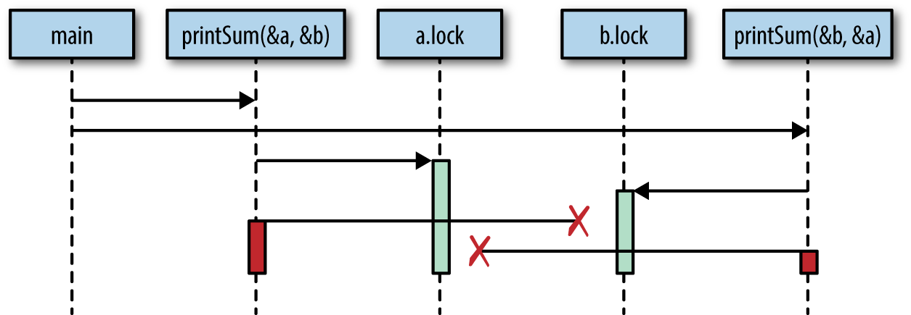

## <span style="color:DodgerBlue">**Go**</span> Study Part 3 - Concurrency1

Notifier: This series is based on the book [Go in Action](https://www.manning.com/books/go-in-action)& [Concurrency in Go: Tools and Techniques for Developers](https://www.oreilly.com/library/view/concurrency-in-go/9781491941294/).

>Concurrent code is notoriously difficult to get right.

1.  Race conditions  
A race condition occurs **when two or more operations must execute in the correct order, but the program has not been written so that this order is guaranteed to be maintained.**

2.  Atomicity
When something is considered atomic, or to have the property of atomicity, this means that **within the context that it is operating, it is indivisible, or uninterruptible.** So, if something is atomic, it is safe within concurrent contesxts implicitly.

3.  Memory Access Synchronization  
```go
var data int 
go func() { data++}()// critical section 1
 if data == 0 {// critical section 2
     fmt.Println("the value is 0.") } // critical section 3
 else { fmt.Printf("the value is %v.\n", data) }
```
sync.mutex ype is used to synchronize access to a shared resource.


4.  Deadlocks, Livelocks, and Starvation  
a.  Deadlock : A deadlocked program is one in which all concurrent processes are waiting on one another. In this state, the program will never recover without outside intervention.


```go
type value struct { 
    mu    sync.Mutex
    value int 
}

var wg sync.WaitGroup
printSum := func(v1, v2 *value) {
    defer wg.Done()
    v1.mu.Lock() 
    defer v1.mu.Unlock() 
    time.Sleep(2*time.Second) 
    v2.mu.Lock() 
    defer v2.mu.Unlock() 
    fmt.Printf("sum=%v\n", v1.value + v2.value) 
}

var a, b value
wg.Add(2)
go printSum(&a, &b) 
go printSum(&b, &a) 
wg.Wait()
```
Code above can be illustrated as below:



As you can see, first printSum is waiting for the second printSum to finish. And the second printSum is waiting for the first printSum to finish. Therefore, both goruoutines are waiting for each other forever.

<span style="color:DodgerBlue">**Go**</span> 
